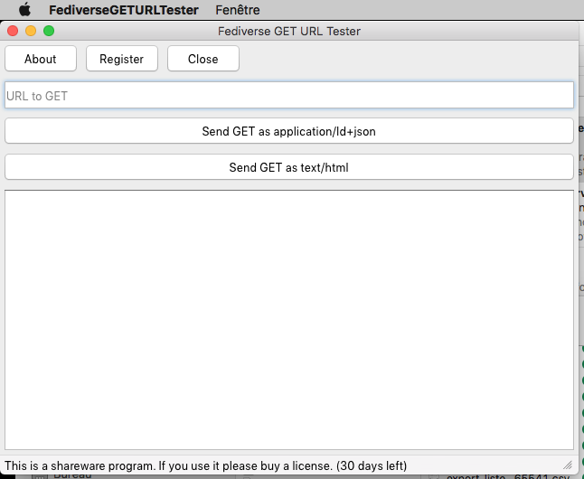

# Fediverse-GET-URL-Tester

A simple program to check what endpoints of Fediverse websites (or ActivityPub compatible websites) answer to GET requests.

## About the project

This program has been coded in [Delphi 11.2 Alexandria](https://developpeur-pascal.fr/delphi.html) from [Embarcadero Technologies](https://www.embarcadero.com/).

Source code is available on [GitHub](https://github.com/DeveloppeurPascal/Fediverse-GET-URL-Tester).

The binary for Windows and Mac are available as shareware. A license can be bought from [Gumroad](https://olfsoftware.gumroad.com/l/FediverseGETURLTester).

## Dependencies

The project uses those libraries as git modules :

* [DeveloppeurPascal/libraries](https://github.com/DeveloppeurPascal/librairies) available for free on GitHub
* [OlfSoftware/BoiteDeDialogueAPropos](https://developpeur-pascal.fr/boite-de-dialogue-a-propos-de.html) for the "about box" dialog available from [Gumroad](https://boutique.olfsoftware.fr/l/tolfaboutdialog-delphi-component)

## How it works

Look at screen captures folder to see how this program works.

* The button "About" show a copyright dialog box.
* The button "Register" open the web browser and go to the shop.
* The button "Close" close the program.
* The edit field needs the URL you want to call. After filling the URL, choose if you want the result as JSON ou HTML. It changes the "Accept" header and the answer will depend on the web server you call.
